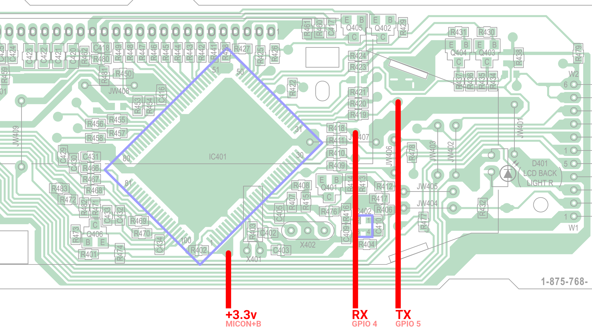

# Sony XDR-F1HD Controller Firmware
In the ``bin`` folder, you'll find the firmware I dumped off of my controller. The unit's serial number is ``129807``.

The firmware was dumped off of the Renesas M16C/62 microcontroller on the controller board. I dumped the firmware by putting the unit in DFU mode (see below) and sending requests to read memory over uart. Since the microcontroller sends no CRC, each page was read twice to ensure consistency (although I don't think I ever had a bad read).

The filenames of each file are the starting addresses in memory. See the [Renesas memory map documentation](https://www.renesas.com/us/en/document/mah/m16c62p-group-m16c62p-m16c62pt-hardware-manual?language=en#page=289) for more information.

## A story
I had wanted to get a firmware dump of this controller for a while so I could implement my own replacement for it. WIthin a few hours, I had figured out how to get the microcontroller into DFU mode and get an ESP32 to talk to it. I was able to get the bootloader version and....not much else. These microprocessors have a protection built-in that allows the chip to be "locked" with a secret 7-byte code that must be sent in order to read/write in DFU mode.

The problem was that I had no clue what this code could be. I tried 0x00..00, 0xFF..FF and combinations of them to no avail. For days, I was stuck on this damn locking code that was the only thing standing between me and this firmware. I wrote programs to autogenerate patterns, wrote programs to try and brute force (the 256^7 combinations of) codes, and even tried to track down codes for other Sony products. Hell, at one point I started trying to glitch the processor by cutting power momentarily while guessing codes. At one point I even started planning an RCE attack over the i2c bus by impersonating the IDM (HD Radio decoder) module to hopefully read the bytes used for the code. I was really banging my head on this thing.

Then, I remembered I had another Sony XDR-F1HD that I had bought for parts for another project. I figured that I may as well try default unlock codes on that unit as well just in case. My hopes were not high as I disassembled it down to the controller and soldered to the test points used for communication. Everything about that unit was identical to the one I had been using. It was even manufactuered at a later date than the one I was first trying, at least according to the serial number. There's no reason why this unit should be any different I thought. I flashed the program to the ESP32 to try the unlock code 0x00000000000000...

...and it UNLOCKED. I couldn't believe it. I reset and tried again and it still worked. I sent a memory read request and it returned data for the first time. At this point I literally got out of my seat dancing and yelling out of happiness.

I have no clue how or why Sony decided not to lock units manufaturered after some date. They must've made some kind of revision and forgot or neglected to put a lock code on it before flashing to devices. It is incredibly lucky that one of my two units happened to have been manufactured at the right time where it was flashed without a lock code, even if it was the second of the two units I tried.

Phew. What a PITA.

## Using the tool
This tool will run on an ESP32 microprocessor. Connect an FAT32 formatted SD card in SPI mode to the ESP32 using the following pins:

| ESP32 GPIO | SD Pin           |
|------------|------------------|
| 15         | Mosi             |
| 2          | Miso             |
| 14         | Sclk             |
| 13         | Cs (chip select) |

Next, solder to the test points and connect wires to the ESP32 GPIOs and power on the board following this diagram:

Next, reset the microprocessor with the reset button in the back of the radio while holding that 3.3v line indicated above. If you've chosen not to solder it and only have a single pair of hands, I've found that holding the reset button, unplugging the radio, positioning the wire on the pin above and plugging the radio in with your foot works.

Finally, build and flash the code in the ``dumper-util`` directory to an ESP32. Assuming all goes well, it should start printing dump progress. Dumping could take a while (perhaps ~5 minutes) as we're running at 38400 baud which is the maximum the microprocessor will run at.

## Using the tool (troubleshooting)

### "Failed to open SD card!" error
Check and make sure the SD card is FAT32 formatted. Perhaps try formatting it clean first.

### "Bootloader version: " repeated over and over
This happens when communication is poor or more likely nonexistent. Check your connections. Make sure the microprocessor is in DFU mode by checking the controller screen. If nothing is displayed and the backlight is dim, it is in DFU mode. If it is normal, you either haven't correctly reset the microprocessor or the 3.3v connection indicated above is incorrect. The bootloader version is requested over and over until it begins with the letters "VER", so no need to reset the ESP32.

### "failed to unlock chip..." error
Like my first unit, your unit has a locked chip with an unknown code. There isn't much you can do about this, sorry. Thanks for trying anyways!

### "failed to change baud rate!" error
If for some reason the chip doesn't support the higher baud rate, you might see this. Try commenting out the responsible code, rebuilding and flashing to the ESP32, and try again.